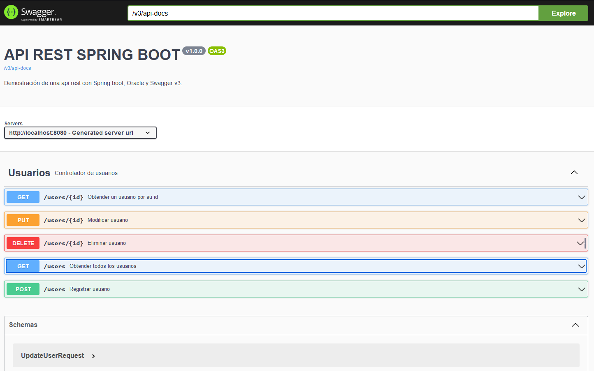

# Documentación de API REST con Spring Boot y Oracle DB

## Información del Proyecto

- **Versión de Java:** 17
- **Versión de Spring Boot:** 3.2.1
- **Gestor de Dependencias:** Maven

## Descripción del Proyecto

Este proyecto utiliza Spring Boot para implementar una API REST. Proporciona servicios y funcionalidades específicas que se describen en detalle a continuación con respescto al mantenimiento de usuarios.

## Swagger Documentation

La documentación detallada de la API se encuentra disponible a través de Swagger. Puede acceder a la interfaz de usuario de Swagger y explorar los endpoints y modelos de datos utilizando el siguiente enlace:

`http://localhost:8080/doc/swagger-ui/index.html`

